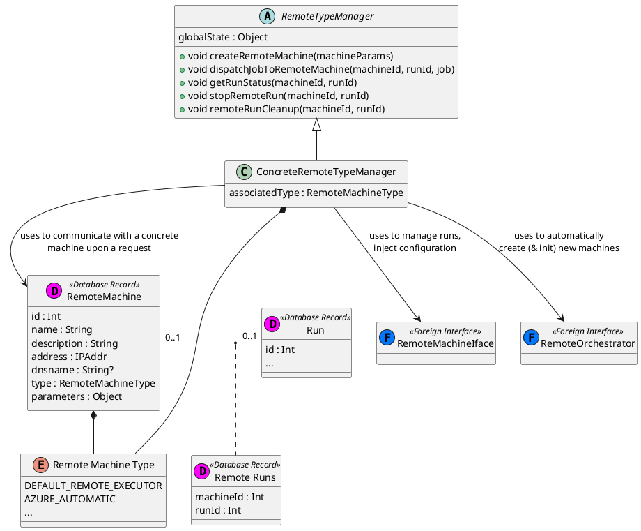

# Remote jobs concepts + model

## plantuml diagram

[Link to PNG Render](https://www.plantuml.com/plantuml/png/dLDVQzim47_NfpXI6CcMcEofK4hMaCQGiP2IkZ16eIZorL6nJvvqMbV6llkard5ncqAwfoZoxy_TxqvdZgLbNvL2bT8vwAsnCenBgRQQi0Udfz0_7nwbwNYSfWCubomtqY6iKHcRmsG2VuJEuGGMn89aXU5uoLPJ8N9qokgQjQ7dIvdd5fsBX8jfE8F8oNLuNmG_rF5lfv8it8bQse1aj96_sjoXOl5NT2k7jITtMDtLa_HYLxxrr9vRtQZtlXII98bi95-rHJLTG6oZ5y3dytHwzIsxMS-Ngsn-C_y-drrbgxMO_hXQps-cuRoSPelPJajk75kfkCaagYmboG9jq2fAiv7b9Kl6vrW-mIyJAb8MmtKdoNxJzaKCqmrso5oxMhBQVZMRpEmbBF8XM4_nvyviMcA172AAzjwzWhOenwP-KWtWjs5s1vcLACdNUv3jO6Q6b4N6rvdWRqRAtTwq0jCeBHdpxAqrQnqwdnQtKk7Z9gJ3e_7u-3XkGceiweBYtD4-0YQJ3dbbrHRZyDZOWyZYvGliZPFaSmz6kqC8H_HVW8RnTW19qdq5hyK-ZaRxTrAydUP_aKQZ2RmqFu6UT-Y03IXJLPwqYZjxhtaB4bIZTKrLu-5hGo31ua-FZj_d5gVLjQmUiN6BtF2QDCLd4arlTU6jP6te88VkI3iEqhEfWfAIPVbm7PLYU_qFe4dp00ZleMajZEOCAVTL-Gy0)

[Link to SVG Render](https://www.plantuml.com/plantuml/svg/dLDVQzim47_NfpXI6CcMcEofK4hMaCQGiP2IkZ16eIZorL6nJvvqMbV6llkard5ncqAwfoZoxy_TxqvdZgLbNvL2bT8vwAsnCenBgRQQi0Udfz0_7nwbwNYSfWCubomtqY6iKHcRmsG2VuJEuGGMn89aXU5uoLPJ8N9qokgQjQ7dIvdd5fsBX8jfE8F8oNLuNmG_rF5lfv8it8bQse1aj96_sjoXOl5NT2k7jITtMDtLa_HYLxxrr9vRtQZtlXII98bi95-rHJLTG6oZ5y3dytHwzIsxMS-Ngsn-C_y-drrbgxMO_hXQps-cuRoSPelPJajk75kfkCaagYmboG9jq2fAiv7b9Kl6vrW-mIyJAb8MmtKdoNxJzaKCqmrso5oxMhBQVZMRpEmbBF8XM4_nvyviMcA172AAzjwzWhOenwP-KWtWjs5s1vcLACdNUv3jO6Q6b4N6rvdWRqRAtTwq0jCeBHdpxAqrQnqwdnQtKk7Z9gJ3e_7u-3XkGceiweBYtD4-0YQJ3dbbrHRZyDZOWyZYvGliZPFaSmz6kqC8H_HVW8RnTW19qdq5hyK-ZaRxTrAydUP_aKQZ2RmqFu6UT-Y03IXJLPwqYZjxhtaB4bIZTKrLu-5hGo31ua-FZj_d5gVLjQmUiN6BtF2QDCLd4arlTU6jP6te88VkI3iEqhEfWfAIPVbm7PLYU_qFe4dp00ZleMajZEOCAVTL-Gy0)
	

## Classes

`Remote type manager` is an abstract interface which only defines a set of abstract methods and the global state (more on that later).

For each `Remote machine type`, there will be exactly **one** `ConcreteRemoteTypeManager` instance, implementing the aforementioned abstract interface to correctly delegate queries and commands to relevant infrastructure.

For example, a concrete remote manager for a cloud service-backed machine type would be able to create a new mahcine only using account credentials and some additional information (like the last - if any - subnet used) available through the `globalState` field.

In general, though, the main work of each `ConcreteRemoteTypeManager` is to provide the implementation for the communication regarding a job run. The IVIS-core run manager would, in case of a remotely executed job, only delegate `RUN` and `STOP` request to a different logic which would select the appropriate `ConcreteRemoteTypeManager` to execute the commands.

### Push vs Pull

Previous paragraph does not make any mentions of the run status update action. Currently, the idea is that the IVIS-core run manager will periodically check for all remote runs' states and update the internal run table. (Pull method)

This approach, however, has the potential to become extremely resource-demanding. 
Thus, change to a push method is encouraged and will be pursued.

#### Push communication

This may be implemented in the following way: much like the `elasticsearch` endpoint, another endpoint (`RC`- remote communication - endpoint for brevity) will be introduced and secured via the reverse SSL proxy used by the IVIS-core SSL-secured installation.

The `RC` endpoint will be used to inform IVIS-core about run's status. This includes (not exhaustive): transition from `queued` to `running` state, run failure and success (remote build fail, run fail) - which includes the output logs. Apart from these obvious cases, there exist a few places where the run manager alerts (emits to) IVIS-core about other event types (related to building). This should be technically possible to implement as well, though more research is needed (TODO). 

Each request to the `RC` (or `elasticsearch`) endpoint will be secured using the SSL client verification and since IVIS-core itself will have a valid SSL certificate, the remote machine will also be able to verify the identity of the server.

The client certificates will be generated by the IVIS-core when creating a new remote machine and will be required to be injected into the machine.

For the purpose of generating the client key pair, there must exist a local Certificate Authority on the server, for now I will assume that the implementation inside the `server/certs` directory is correct. (Otherwise I am going to use my own tested implementation).